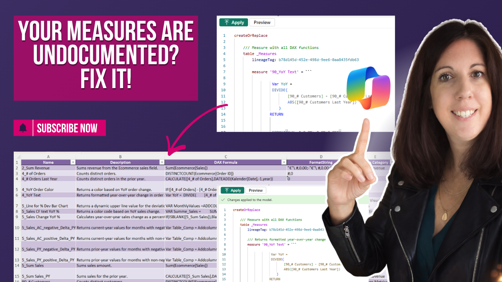

# Create a Data Catalog from TMDL with Copilot

In this tutorial, you’ll learn how to generate scalable measure documentation in Power BI using TMDL and Copilot Chat.

Instead of manually documenting measures, we use metadata extraction and AI to create a structured, review-friendly data catalog.

---

## 🎥 Watch the tutorial

[Create a Data Catalog from TMDL using Copilot](https://www.youtube.com/watch?v=2cA5Yxi_75k&t=40s)

---

## 🧠 What this project does

This approach helps you solve one of the biggest issues in Power BI models: missing or unclear measure documentation.

It allows you to:
- extract measure metadata directly from TMDL  
- generate structured descriptions using Copilot  
- create a clean data catalog for review  
- write descriptions back into your model  

---

## 🚀 What you’ll learn

In this tutorial, you’ll see:

- why manual measure documentation does not scale  
- how to extract measure metadata from TMDL  
- how to generate descriptions using Copilot Chat  
- how to create a review-friendly Excel data catalog  
- how to write descriptions back into your model  

---

## 📂 Resources

### Generate Data Catalog
Use this file to extract and generate measure documentation:

➡️ [TMDL to Data Catalog](./TMDL-to-Data-Catalogue.txt)

---

### Write Back to Model
Use this file to update your model with descriptions:

➡️ [Update TMDL with Data Catalog](./Update-TMDL-with-Data-Catalogue.txt)

---

## 🖼️ Preview

---

## 🎯 Who this is for

- Power BI developers working with larger models  
- BI analysts maintaining semantic models  
- Teams struggling with missing documentation  
- Anyone using TMDL and Copilot in their workflow  

---

## 💡 Use cases

- Standardize measure documentation across models  
- Improve model transparency and usability  
- Enable easier collaboration between teams  
- Prepare models for handover or scaling  

---

## 🛠️ How to use

1. Watch the tutorial  
2. Extract your model metadata using TMDL  
3. Use the prompt to generate descriptions  
4. Review and adjust the data catalog  
5. Write descriptions back into your model  

---

## 🔄 Extend this

You can build on this approach by:
- standardizing naming conventions  
- automating documentation workflows  
- integrating with governance processes  
- applying the same logic to columns and tables  
