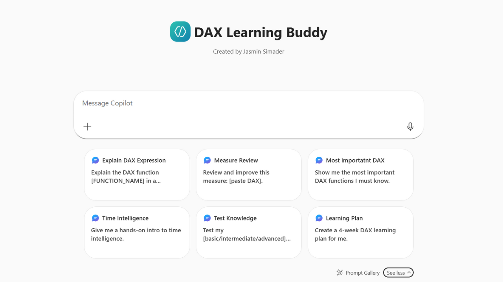
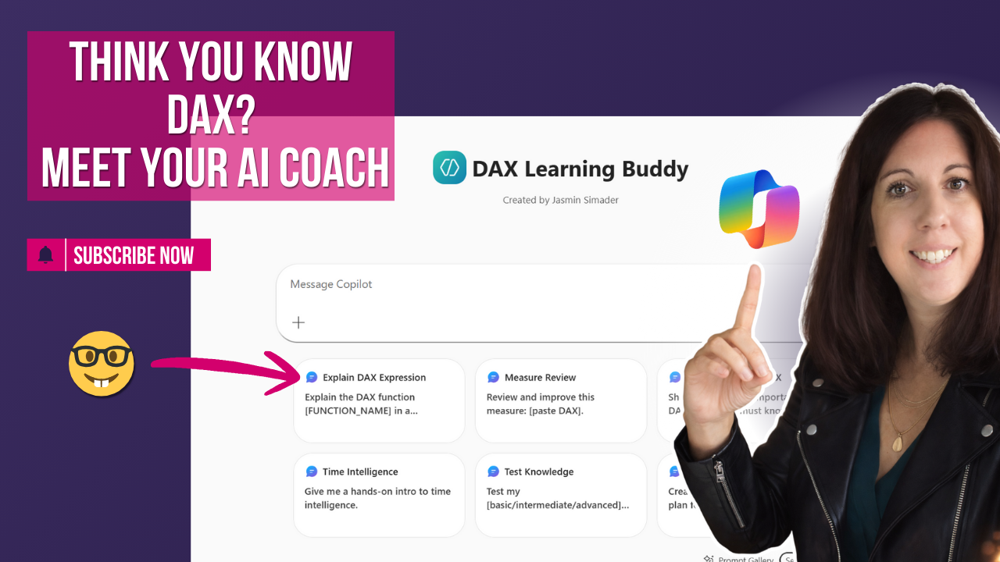

# DAX AI Coach with Copilot

In this tutorial, you’ll learn how to build a DAX AI Coach for Power BI using Microsoft Copilot.

We create an agent that helps business analysts learn DAX through structured explanations, practical examples, and gamified challenges.

---

## 🎥 Watch the tutorial

[How to Build a DAX AI Coach for Power BI using Copilot](https://www.youtube.com/watch?v=cSiRsAH_Fow))

---

## 🧠 What this project does

This agent acts as a learning companion for DAX and Power BI.

It helps users:
- understand DAX concepts step by step  
- practice with real examples  
- progress through structured learning levels  
- stay engaged through gamified challenges  

---

## 🚀 What you’ll learn

In this tutorial, you’ll see:

- how to design the purpose and behavior of an AI agent  
- how to structure learning flows for DAX concepts  
- how to add gamification (levels, challenges)  
- how to guide users from beginner to advanced  
- how to configure everything in Copilot (M365)  

---

## 📂 Resources

### Agent Instructions
Full configuration and setup instructions:

➡️ [View instructions](./DAX Learning Buddy.txt)

---

### Preview

#### Learning Buddy

---

### Video Thumbnail

---

## 🎯 Who this is for

- Power BI users who want to improve their DAX  
- BI analysts building internal training tools  
- Anyone exploring AI agents for learning  
- Teams looking for structured, interactive DAX training  

---

## 💡 Use cases

- Internal DAX training assistant  
- Self-paced learning companion  
- Onboarding support for new analysts  
- Interactive knowledge sharing in BI teams  

---

## 🛠️ How to use

1. Watch the tutorial  
2. Open the instruction file  
3. Recreate the agent in Copilot M365  
4. Adapt the prompts and structure to your needs  

---

## 🔄 Extend this

You can build on this concept by:
- adding more advanced DAX topics  
- customizing challenges for your team  
- integrating real company datasets  
- creating multiple learning paths  

---

## 🔗 Related content

🎥 YouTube: [your channel link]  
📝 Blog / Medium: [your link]
